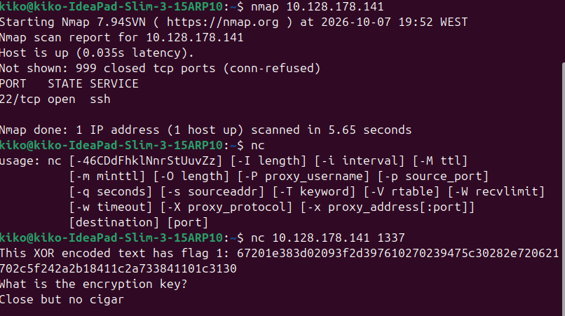

# W1seGuy

The lab starts by downloading the files to analyse the code.

def send_message(server, message):
    enc = message.encode()
    server.send(enc)

message.encode() converts a string to a byte sequency, using UTF-8 by default. You can put them back to normal with decode().

UTF-8 is a codification of text, a bunch of rules to represent characters in bytes. The bytes are stored in binary. There are other codificators like ASCII each represent words to binary in different forms.

.hex() represent bytes in hexadecimal

server = socketserver.ThreadingTCPServer(('0.0.0.0', 1337), RequestHandler)
server.serve_forever()

Opens a server in the port 1337. 0.0.0.0 accepts connections from IPv4 of the machine, so every one in the network can connect because of 0.0.0.0, while 127.0.0.1 is only localhost

Now that we saw all the code we going to start the machine

## 2 Step

Netcat (nc) is a tool used to send and receive data in the network using TCP or UDP, we going to connect to the machine.

We do this and receive this image 
A message saying This XOR encoded text has flag 1: 67201e383d02093f2d397610270239475c30282e720621702c5f242a2b18411c2a733841101c3130
What is the encryption key? 

So for the key, when we receive the XOR the XOR is made by the key + the flag. So if we have the flag and the XOR we can discover the key with a script to solve. So basically this is the file of the server that we are talking too.

We used nmap to analyse the ports but i think in this machine we only focus on this part.

ord("A) gives a number that represents a character in Unicode

chr() does the inverse

### Flag

We dont have the flag too so now we need to do something.

For the xor it uses 5 chars, the key is only 5 chars so for the xor we only use the first 5 char of the flag. We already have THM{ thats 4 so we can try different combinations.

possibilities.py will try every letter so we find the correct key

Now we do another script to try all the combinations in the terminal.

If we have 4 characters of the key and 4 chars of the flag we going to brute force our way in, the a chance to be correct is 1/62 so this goes like this 

| Attempts | Probability of at least one success |
| -------- | ----------------------------------- |
| 62       | ≈ 63.51%                            |
| 310      | ≈ 99.35%                            |
| 620      | ≈ 99.9958%                          |
| 1,000    | ≈ 99.999991%                        |

# DONE