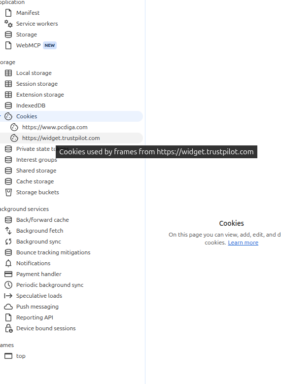

# Application

This is the application panel, this is a important panel because it lets you inspect the data and browser-side features associated with the current website: storage, cookies, service workers, caches, backgroun services, and some newer web plataform featuresx

## Local storage

Store key-value data for a specific origin
Example:

theme = dark
username = testuser

It usually remains there even after closing and reopening the browser.

Think:

Website
   ↓
Local Storage
   ↓
Persistent client-side data

## Session storage

Very similar to local storage, but tied to the current browser session/tab.

Local Storage -> persists
Session Storage -> temporary for that session/tab

Chrome lets you inspect and edit both as key-value pairs in the Application panel.

## Indexed DB

This is more like a database inside the browser.

Instead of simple:

key → value

you can store much more structured data.

For example:

Database: shop

Users
Products
Orders

Web applications can use IndexedDB for larger or more complex datasets and even offline functionality. Chrome DevTools lets you inspect databases, object stores, and indexes here.

## Cookies
The most important one

This is more like a database inside the browser.

Instead of simple:

key → value

you can store much more structured data.

For example:

Database: shop

Users
Products
Orders

Web applications can use IndexedDB for larger or more complex datasets and even offline functionality. Chrome DevTools lets you inspect databases, object stores, and indexes here.

Some of those are worth knowing:

Secure
→ cookie should only be sent over HTTPS

HttpOnly
→ JavaScript cannot normally read/modify it

SameSite
→ controls when the cookie can be sent in cross-site situations

## Cache Storage
This storage is used by web applications, often together with Service Workers

For example:

Website visits server
        ↓
Stores assets in Cache Storage
        ↓
Later visit
        ↓
Can reuse cached files

This can help with:

faster loading
offline apps
Progressive Web Apps

## Service Workers

You have:

Service workers

near the top.

A Service Worker is a JavaScript worker that can operate separately from the page and act as an intermediary between the web application, browser, and network.

Simplified:

Webpage
   ↓
Service Worker
   ↓
Network / Cache

It can help implement:

offline support
caching
push notifications
background behavior

### Key idea

The Application panel shows what a web application stores
and manages inside the browser.