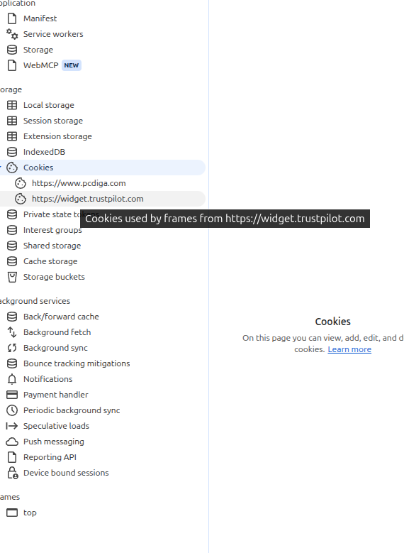

# Application


The Application panel lets you inspect data and browser-side features associated
with the current website, including storage, cookies, service workers, caches,
background services, and newer web platform features.

## Local storage

Local Storage stores key-value data for a specific origin.

```text
theme = dark
username = testuser
```

It usually remains there even after closing and reopening the browser.

```text
Website
   |
   v
Local Storage
   |
   v
Persistent client-side data
```

## Session storage

Very similar to local storage, but tied to the current browser session/tab.

- **Local Storage**: Persists after the browser is closed.
- **Session Storage**: Is temporary and tied to the current session or tab.

Chrome lets you inspect and edit both as key-value pairs in the Application panel.

## IndexedDB

This is more like a database inside the browser.

Instead of simple:

key → value

you can store much more structured data.

For example:

```text
Database: shop
   - Users
   - Products
   - Orders
```

Web applications can use IndexedDB for larger or more complex datasets and even offline functionality. Chrome DevTools lets you inspect databases, object stores, and indexes here.

## Cookies

Cookies are small pieces of data that a website stores in the browser and that
the browser can send with later requests.

Some of those are worth knowing:

- **Secure**: The cookie should only be sent over HTTPS.
- **HttpOnly**: Client-side JavaScript cannot normally read or modify it.
- **SameSite**: Controls when the cookie can be sent in cross-site requests.

## Cache Storage
This storage is used by web applications, often together with Service Workers

```text
Website visits server
   |
   v
Stores assets in Cache Storage
   |
   v
Later visit
   |
   v
Can reuse cached files
```

This can help with:

- Faster loading
- Offline applications
- Progressive Web Apps

## Service Workers

Service workers appear near the top of the Application panel.

A Service Worker is a JavaScript worker that can operate separately from the page and act as an intermediary between the web application, browser, and network.

```text
Webpage
   |
   v
Service Worker
   |
   v
Network / Cache
```

It can help implement:

- Offline support
- Caching
- Push notifications
- Background tasks


### Key idea

The Application panel shows what a web application stores and manages inside
the browser.