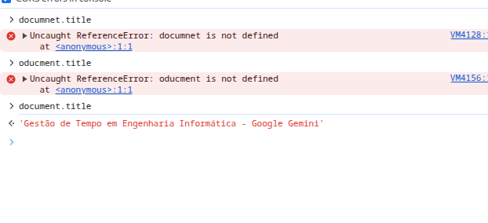

# Console

The console is one of the most useful DevTools panels because it lets you do two main things: see messages and errors produced by the page and run JavaScript directly in the context of the current webpage.

In your screenshot, the big empty area at the bottom is where you type JavaScript. For example, try:
1 + 1
You should get:
2

Then try:document.title
That returns the title of the current page.

Then:window.location.href
That shows the current URL.

And:document.body
returns the <body> DOM element of the current page.

In your screenshot, you also have several settings open. The important ones are:

Network messages — shows certain network-related messages in the Console.
Preserve log — normally the Console may clear when you navigate/reload; this keeps previous messages.
Group similar messages — combines repeated messages so the Console does not become flooded.
CORS errors in console — shows Cross-Origin Resource Sharing errors, useful when requests between different origins are blocked.
Eager evaluation — shows a preview of the result while you're still typing an expression.
Autocomplete from history — suggests commands you've previously entered.
Treat code evaluation as user action — makes commands run from the Console behave as if triggered by user interaction in cases where browser APIs require user activation.

## Console Performance Warnings

The browser Console may show `[Violation]` warnings when JavaScript takes too long to execute.

Examples:

- Slow `requestAnimationFrame` callback
- Slow `setTimeout` callback
- Forced layout/reflow
- Resources preloaded but not used

These warnings do not necessarily mean the website is broken or insecure.
They usually indicate possible performance inefficiencies.