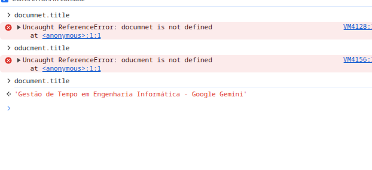

# Console

The Console is one of the most useful DevTools panels because it lets you see
messages and errors produced by the page and run JavaScript in the context of
the current webpage.



The input area at the bottom is where you type JavaScript. For example:

```js
1 + 1
// 2
```

`document.title` returns the title of the current page.

`window.location.href` shows the current URL.

`document.body` returns the page's `<body>` DOM element.

Important settings include:

- **Network messages**: Shows certain network-related messages.
- **Preserve log**: Keeps messages when you navigate or reload.
- **Group similar messages**: Combines repeated messages.
- **CORS errors in console**: Shows errors when cross-origin requests are blocked.
- **Eager evaluation**: Previews an expression's result while you type.
- **Autocomplete from history**: Suggests previously entered commands.
- **Treat code evaluation as user action**: Runs commands as though they were
	triggered by user interaction when browser APIs require user activation.

## Console Performance Warnings

The browser Console may show `[Violation]` warnings when JavaScript takes too long to execute.

Examples:

- Slow `requestAnimationFrame` callback
- Slow `setTimeout` callback
- Forced layout/reflow
- Resources preloaded but not used

These warnings do not necessarily mean the website is broken or insecure.
They usually indicate possible performance inefficiencies.