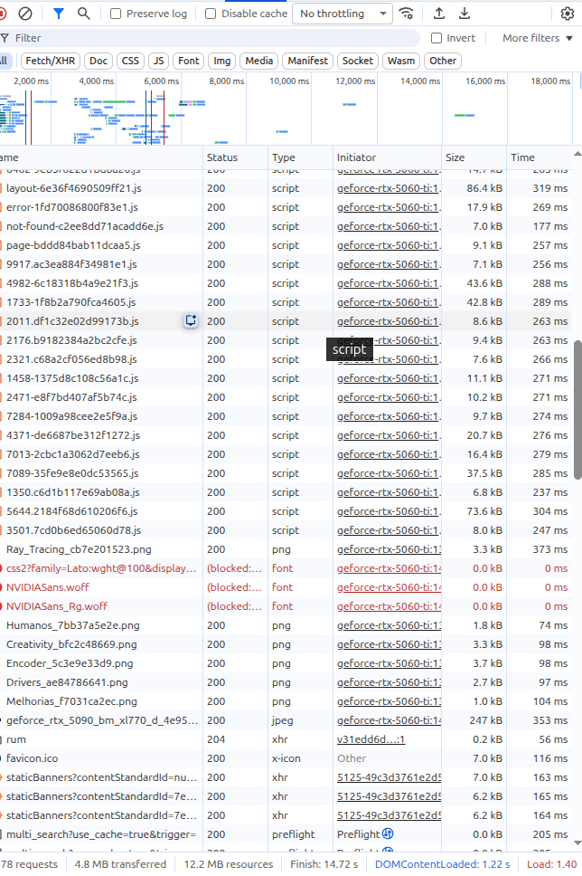

# Network

The Network panel is one of the most useful DevTools tabs because it lets you see the communication between the browser and the servers.

Example screenshot:

In this case, files such as these are visible:

layout-6e36f4690509ff21.js
error-1fd70086800f83e1.js
Ray_Tracing_cb7e201523.png
NVIDIASans.woff
favicon.ico

Conceptually:

Browser
   |
   |---- request ----> Server
   |
   |<--- response ---- Server

Chrome records those requests in the Network panel while DevTools is open.

The columns shown are:
Name | Status | Type | Initiator | Size | Time

Name -> the name of the resource

Status -> the HTTP response status

Type -> the type of resource Chrome thinks it is

Initiator -> what caused this request to happen

Size -> how much data was transferred for the resource

Time -> how long the request took

Very roughly:
Browser sends request
       ↓
waits
       ↓
receives response
       ↓
319 ms total

### Common resource types

- document
- script
- stylesheet
- image
- font
- Fetch/XHR
- WebSocket

### Request details

When you select a request, DevTools can show:

- Headers
- Payload
- Preview
- Response
- Initiator
- Timing

## Chrome DevTools Network vs Wireshark

### Chrome DevTools - Network

Chrome DevTools shows network activity from the browser's point of view.

It focuses mainly on application-level requests and responses, such as:

- HTTP/HTTPS requests
- Request methods (GET, POST, etc.)
- Status codes
- Request and response headers
- Cookies
- API requests
- Response bodies
- Resource loading times

DevTools does not show raw network packets.

It is mainly useful for understanding how a webpage communicates with servers.

---

### Wireshark

Wireshark is a network packet analyzer.

It captures traffic directly from a network interface and allows us to inspect lower-level network communication.

It can show:

- Ethernet frames
- IP packets
- TCP segments
- UDP datagrams
- Ports
- DNS traffic
- TLS traffic
- QUIC traffic
- Packet sizes
- Sequence numbers
- Timing

For HTTPS traffic, the HTTP content is normally encrypted, so Wireshark may only show TLS/QUIC traffic unless the session keys are available.

---

### Main Difference

Chrome DevTools:

Browser → HTTP request/response view

Wireshark:

Network interface → Packet-level view

Example:

DevTools may show:

GET /image.png  
200 OK  
Size: 500 KB

Wireshark may show hundreds of individual packets that together carry that same 500 KB response.

Therefore:

**DevTools shows what the browser is requesting.  
Wireshark shows how that data actually travels across the network.**

