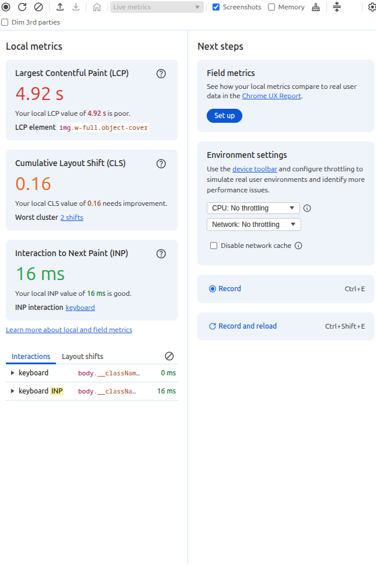

# Performance

The Performance panel measures how fast and smooth a webpage feels while loading and while the user interacts with it.

The image shows the three main Core Web Vitals:

LCP -> Loading speed
CLS -> Visual stability
INP -> Responsiveness

## LCP - Largest Contentful Paint

The value is 4.92 s, which is poor.

LCP measures how long it takes for the largest visible content element in the viewport to appear, usually a large image, heading, or hero banner. In the screenshot, Chrome also identifies the element responsible.

The usual thresholds are:

≤ 2.5 s       Good
2.5–4.0 s     Needs improvement
> 4.0 s       Poor

## CLS - Cumulative Layout Shift

CLS measures how much content unexpectedly moves while the page is loading.

Imagine this:

Page begins loading

[Article title]

[Button]

        ↓ image loads suddenly

[Large Image]

[Article title]

[Button]

The title and button suddenly move down.

That contributes to CLS.

Thresholds:

≤ 0.10        Good
0.10–0.25     Needs improvement
> 0.25        Poor

## INP - Interaction to Next Paint

INP measures how responsive the page feels after a user interaction.

For example

You press a button
       ↓
Browser receives click
       ↓
JavaScript executes
       ↓
Page visually reacts

INP measures how long it takes for the next visible update to appear after that interaction.

Thresholds:

≤ 200 ms       Good
200–500 ms     Needs improvement
> 500 ms       Poor